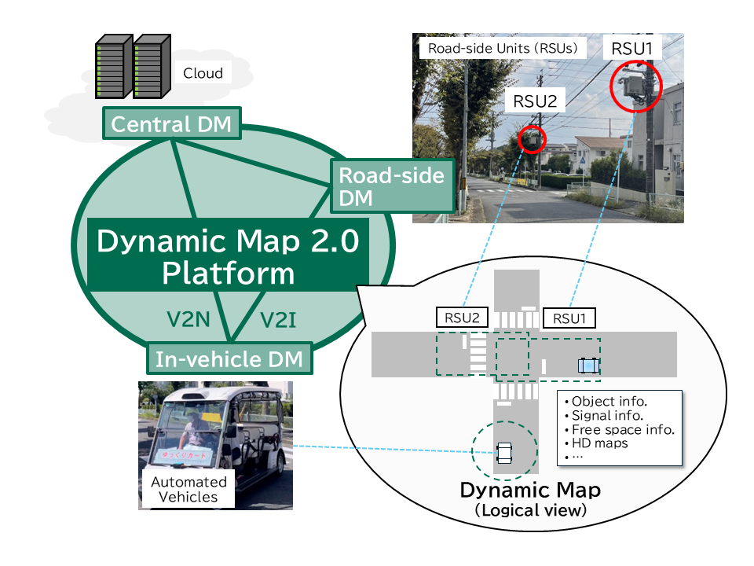
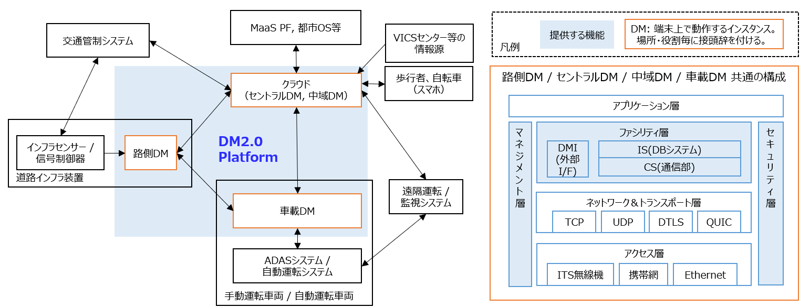

# DM2.0 Platform

---

## 概要

ダイナミックマップ2.0プラットフォーム(DM2.0 Platform) は、車両、路側機、クラウドをつないだ情報連携のためのオープンソースの情報通信プラットフォームです。

インフラ協調型の自動運転をはじめとした、先進的なモビリティサービスを実現する基盤ソフトウェアとして開発されました。
動的情報（物標情報、信号情報、フリースペース情報など）と静的情報（3次元高精度道路地図など）への横断的な統合・検索機能を提供し、ITS無線や携帯回線などの異なる通信方式を扱い、それらを単独または同時併用することも可能です。

## 特徴

* アーキテクチャ/設計
  * 国際標準化機構のISO21217:2010の対応規格である[ETSI EN 302 665 V1.1.1 (2010-09)](https://www.etsi.org/deliver/etsi_en/302600_302699/302665/01.01.01_60/en_302665v010101p.pdf)を参考に設計
  * センサデータ処理のためのストリーム型DBを備え、SQLベースの[クエリ言語](https://www.nces.i.nagoya-u.ac.jp/admobi-dm2/images/dm2_query_language_specification_20260327.pdf)をサポート
  * C++による実装、動作OSとして Ubuntu 20.04 / 22.04 / 24.04 に対応
* 通信方式・セキュリティ
  * 5G/LTE携帯回線と760MHz帯ITS無線機に対応、単独利用や併用が可能（将来的にLTE-V2X・NR-V2Xにも対応できる設計を採用）
  * リアルタイム性と暗号化の両立のため、ネットワーク層・トランスポート層の通信には DTLS (Datagram Transport Layer Security)を採用 (QUIC対応は今後のバージョンアップで予定あり)
  * 公開鍵基盤（PKI: Public Key Infrastructure）を利用したセキュリティ確保の仕組みを提供
* データ形式
  * [ITS Japan 自動運転研究会 CCAM検討SWG共通の路側機センサー部インタフェース仕様](https://www.road-to-the-l4.go.jp/activity/theme04/pdf/CooL4_SensorInterfaceSpecification_v100.pdf)のサポート
  * ROS2通信メッセージとの相互変換をサポート
  * 3次元高精度道路地図フォーマットとして[Lanelet2](https://github.com/fzi-forschungszentrum-informatik/lanelet2)形式に対応。道路地図の格納は PostgreSQL + PostGIS と連携
* 拡張性
  * クライアントプログラムを開発するためのAPIを提供
  * ユーザ定義のストリームの追加や、ユーザ定義の関数を追加が可能
* 導入実績
  * 経済産業省による自動運転レベル4等先進モビリティサービス研究開発・社会実装プロジェクト（[RoAD to the L4](https://www.road-to-the-l4.go.jp/)）のテーマ4（[CooL4](https://www.road-to-the-l4.go.jp/activity/theme04/)）での社会実装実績あり
  * 千葉県柏市柏の葉地域の道路インフラ装置に取り付けた路側センサーの情報を自動運転バスへ提供

## 文書
* プラットフォームを開発している背景について知りたい方は[こちら](docs/background.md)
* DM2.0 Platformの優位性や他との違いを知りたい方は[FAQのページへ](docs/faq.md)
* セキュリティの仕組みを知りたい方は[こちら](docs/security_architecture.md)

## インストール
* ITS端末間の通信プラットフォームを構築したい場合は、[dm2のインストール](dm2/README.md)を参照して下さい。
* インフラセンサーや車載センサーの情報をプラットフォーム上で交換したい場合は、[dmiのインストール](dmi/README.md)を参照して下さい。メッセージ仕様は、標準で[CooL4 API仕様](https://www.road-to-the-l4.go.jp/activity/theme04/pdf/CooL4_DataIntegrationPF_API_Spec_v100.pdf)をサポートしています。
* プラットフォーム内の動作を見たい場合は、[demoのインストール](demo/README.md)を参照して下さい。路側センサーが生成した情報をクラウド経由で車両に届けるまでの動作を簡易的に模擬させたテストベッドを用意しています。

## 使用例
* ROS2やUDPデータを使った使用例やアプリケーション開発方法について知りたい方は、[こちら](example/README.md)

## プラットフォームの開発活動
DM2.0 Platform は、名古屋大学・同志社大学および複数の企業・非営利組織が共同で開発してきた成果です。現在も開発活動を進めており、コンソーシアム型の共同研究組織として活動を続けています。使用中に軽微な問題を見つけた場合は遠慮なく報告して構いませんが、機能に関する要望やPRを求める場合、まずは我々のコンソーシアムへの参加をご検討下さい。詳細は[こちら](https://www.nces.i.nagoya-u.ac.jp/cav-dm2/index.html)。

## ライセンス
このプロジェクトはMITライセンスに基づいてライセンスされています。詳細はLICENSEファイルを参照してください。

## 謝辞
本研究の一部は、2021年度～2025年度の経済産業省・国土交通省『自動運転レベル４等先進モビリティサービス研究開発・社会実装プロジェクト』（テーマ４. 混在空間でインフラ協調を活用したレベル４自動運転サービスの実現に向けた取り組み）の委託事業として行われたものであり、また、JSPS科研費JP24H00698の助成を受けたものです。
