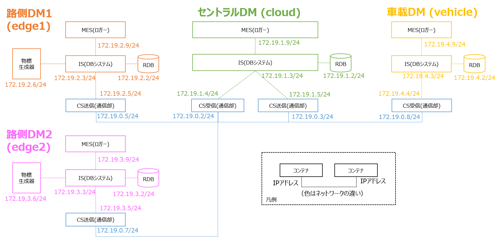

# demo_env

DMの分散配置の一例のデモンストレーションを提供します

## 動作確認環境

- Ubuntu 20.04, Ubuntu 22.04, Ubuntu 24.04
- Docker version 24.0.5 以上

## デモ概要

- ２つの路側DMで生成された物標情報をセントラルDMに集約し，それを車載DMへ伝えるデモです。
- 約 20GB 程の空き容量が必要です。



## 使用方法

- DM2.0 Platform のDockerイメージをビルドします

```bash
  cd ..
  ./build.bash
```

- リポジトリのルートディレクトリ/demo上で、4つのターミナルを立ち上げ、順番に下記コマンドを実行して下さい。

1. 車載DM内の全てのコンテナをまとめて起動（CS受信, IS, RDB, MESの順番に起動）
```bash
  export DEMO_SAMPLE_PATH=`pwd`; docker compose up vehicle_dm2mes
```

2. セントラルDM内の全てのコンテナをまとめて起動（CS受信, CS送信, IS, RDB, MESの順番に起動）
```bash
  export DEMO_SAMPLE_PATH=`pwd`; docker compose up cloud_dm2mes
```

3. 路側DM１内の全てのコンテナをまとめて起動（CS送信, IS, RDB, 物標生成器, MESの順番に起動）
```bash
  export DEMO_SAMPLE_PATH=`pwd`; docker compose up edge1_dm2mes
```

- 暫く待つと、路側DM１、セントラルDM、車載DMそれぞれのターミナル上でログが以下のように確認できます。

  ```
  9223653511833208384,700718481124,(中略),12,13,14,15,[1721920]

  ```
- 末尾の列の1721920は、情報源が路側DM１であることを示します。

4. 路側DM２内の全てのコンテナをまとめて起動（CS送信, IS, RDB, 物標生成器, MESの順番に起動）
```bash
  export DEMO_SAMPLE_PATH=`pwd`; docker compose up edge2_dm2mes
```

- 暫く待つと、路側DM２、セントラルDM、車載DMのターミナル上で末尾の列の1721930の行が追加されます。

  ```
  9223653511833208394,700718481083,(中略),12,13,14,15,[1721930]

  ```
- 路側DM２からの情報がセントラルDMを通して、車載DMへ届いていることを示します。
  
5. 終了させたい場合は、4つのターミナル上でCtrl-Cを入力すれば、暫くした後、停止します。

- Ctrl-Cだけではコンテナが停止されずに残る場合があります。`docker ps -a`コマンドでコンテナが残っているか確認し、残っている場合は下記コマンドで古いコンテナを全て削除して下さい。
```bash
  docker compose down --remove-orphans
```