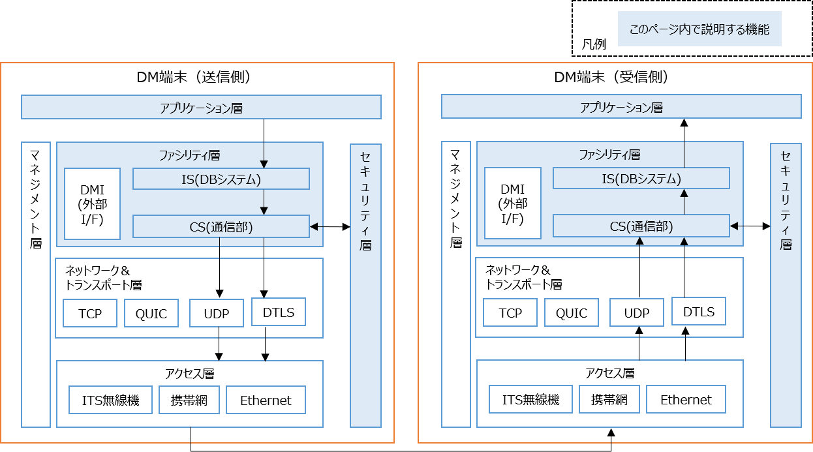

# dm2

---

## 概要

DM2.0 Platformの中で、端末間の通信を行うために必要なC++ライブラリおよびモジュール。
擬似的なストリームデータを用意することで、送信側のDM端末から受信側のDM端末へとデータ連携が可能となります。


---


## 動作確認環境

Ubuntu 20.04, Ubuntu 22.04, Ubuntu 24.04

## Dockerイメージの構築

リポジトリのルートディレクトリ/dm2上で下記のコマンドを実行して下さい。

```bash
make without_dmi -f makefile_docker
```

イメージ構築後は、docker runコマンドを使って試すことができますが、[使用例](../example/README.md)は手動インストール後のコマンド例となるため、~/.bashrcに下記の関数を登録しておくことで、手動インストールとの差異を無くす事ができます。`-v`は、「コンテナ間で設定ファイルやログ、FDファイルを共有するためのオプション」です。`PROJECT_DIR`は、適宜、書き換えて下さい。

```bash
PROJECT_DIR=~/dm20
function dm2cs_send () {
  docker run -it --init --rm --net host --name cs_send -v ${PROJECT_DIR}/dm2/conf:/tmp/conf dm2/cs:20.04 dm2cs_send -d /tmp/conf;
}
function dm2cs_recv () {
  docker run -it --init --rm --net host --name cs_recv -v ${PROJECT_DIR}/dm2/conf:/tmp/conf dm2/cs:20.04 dm2cs_send -d /tmp/conf;
}
function dm2is () {
  docker run --init --rm --net host --name rdb -e POSTGRES_PASSWORD=postgres dm2/rdb:20.04 > /dev/null 2>&1 &
  docker run -it --init --rm --net host --name is -v ${PROJECT_DIR}/dm2/conf:/tmp/conf dm2/is:20.04 dm2is -d /tmp/conf
}
function dm2mes () {
  docker run -i --rm --net host dm2/dm2mes:20.04 stdbuf -oL dm2mes "$@";
}
```

## 手動インストール

Dockerを使用せずにホスト上で動くモジュールをビルドしたい場合は、以下の手順に従って下さい。
Ubuntu LTS環境で、依存ライブラリをインストールした上で、makeを使用してビルドを行います。

## 依存ライブラリ

### Ubuntu バージョン別の依存ライブラリ一覧表
| ライブラリ           | 20.04  | 22.04  | 24.04  |
| --------------- | ------ | ------ | ------ |
| g++             | 9.3.0  | 11.2.0 | 13.2.0 |
| build-essential | 12.8   | 12.9   | 12.10  |
| PostgreSQL      | 12.12  | 14.5   | 16.2   |
| PostGIS         | 3.0.0  | 3.2.0  | 3.4.2  |
| OpenSSL         | 1.1.1f | 3.0.2  | 3.0.13 |
| libpqxx         | 6.4    | 6.4    | 7.8.1  |
| GEOS            | 3.8.0  | 3.11.0 | 3.12.1 |
| Xerces          | 3.2.2  | 3.2.3  | 3.2.4  |
| log4cxx         | 0.10.0 | 0.12.1 | 1.1.0  |
| zlib            | 1.2.11 | 1.2.11 | 1.3    |
| Zstandard       | 1.4.4  | 1.4.8  | 1.5.5  |
| Protobuf        | 21.12  | 21.12  | 21.12  |
| libev           | 1.4.31 | 1.4.33 | 1.4.33 |
| yaml-cpp        | 0.6.2  | 0.7.0  | 0.8.0  |


## 依存ライブラリのインストール

### Ubuntu 20.04 / 22.04 / 24.04 共通

```bash
sudo apt update

sudo apt install -y \
  g++ \
  build-essential \
  postgresql postgresql-contrib \
  postgis \
  libproj-dev \
  libpq-dev libpqxx-dev \
  liblog4cxx-dev liblog4cxx-doc \
  libssl-dev \
  zlib1g-dev libzstd-dev \
  libyaml-cpp-dev
```
### Ubuntu 24.04のみ

```bash
sudo apt install -y \
  postgresql-16-postgis-3 \
  libpqxx-7.8t64 \
  libgeos++-dev libgeos-c1t64 libgeos-dev \
  libxerces-c3.2t64 libxerces-c-dev \
  protobuf-compiler libprotobuf-dev
sudo ldconfig
```

### Ubuntu 22.04のみ

```bash
sudo apt install -y \
  postgresql-14-postgis-3 \
  libpqxx-6.4 \
  libgeos++-dev libgeos-c1v5 libgeos-dev \
  libxerces-c3.2 libxerces-c-dev \
  libboost-dev cmake wget
  
wget https://download.osgeo.org/geos/geos-3.11.0.tar.bz2
tar xvf geos-3.11.0.tar.bz2
cd geos-3.11.0
mkdir _build && cd _build
cmake -DCMAKE_BUILD_TYPE=Release -DCMAKE_INSTALL_PREFIX=/usr/local ..
make -j$(nproc)
sudo make install
cd ../..

wget https://github.com/protocolbuffers/protobuf/releases/download/v21.12/protobuf-cpp-3.21.12.tar.gz
tar zxvf protobuf-cpp-3.21.12.tar.gz
cd protobuf-3.21.12
./configure
make -j$(nproc)
sudo make install
sudo ldconfig
```

### Ubuntu 20.04のみ

```bash
sudo apt install -y \
  postgresql-12-postgis-3 \
  libpqxx-6.4 \
  libgeos++-dev libgeos-3.8.0 libgeos-dev \
  libxerces-c3.2 libxerces-c-dev wget

wget https://github.com/protocolbuffers/protobuf/releases/download/v21.12/protobuf-cpp-3.21.12.tar.gz
tar zxvf protobuf-cpp-3.21.12.tar.gz
cd protobuf-3.21.12
./configure
make -j$(nproc)
sudo make install
sudo ldconfig
```

## 依存ライブラリインストール後の手動設定変更 (Ubuntu 22.04のみ)

### log4cxx

- std::shared_mutexからboost::shared_mutexへの切り替えのため、log4cxxの設定ファイル`/usr/include/log4cxx/boost-std-configuration.h`の修正が必要です。

```cpp
#define STD_SHARED_MUTEX_FOUND 1
#define Boost_SHARED_MUTEX_FOUND 0
```

下記のように変更します。
※変更前にバックアップを取得してください。パッケージ更新で上書きされる可能性があります。
```cpp
#define STD_SHARED_MUTEX_FOUND 0
#define Boost_SHARED_MUTEX_FOUND 1
```

## ビルド

リポジトリのルートディレクトリ/dm2上で下記のコマンドを実行して下さい。

```bash
make all
sudo make install
sudo ldconfig
```

- RDB (postgreSQL) にDM2.0 Platform専用のデータベースを設定します。

```bash
sudo -u postgres bash rdb/init.sh 
```

## 例
[一般的な使用例は、こちら](../example/README.md)
