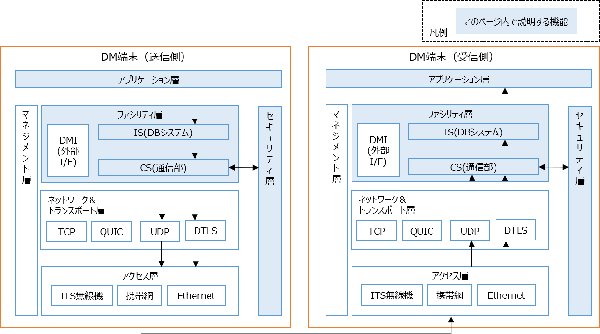

# dm2

---

## 概要

DM2.0 Platformの中で、端末間の通信を行うために必要なC++ライブラリおよびモジュール。

擬似的なストリームデータを用意することで、送信側のDM端末から受信側のDM端末へとデータ連携が可能となります。

---

## インストール

dm2には、以下のインストール方法があります。

* **[A. GitHub Container Registry (GHCR) で公開しているDockerイメージを利用する](./docs/ghcr_install.md)**
* **[B. Dockerイメージを構築して利用する](./docs/docker_build_install.md)**
* **[C. ホスト上でソースコードからビルドする](./docs/host_build_install.md)**

「A. GHCRで公開しているDockerイメージを利用する方法」が最も速く環境を構築できます。
DM2.0PF内部の仕組みに興味がある場合は、他の方法を参照して下さい。

## 例
[一般的な使用例は、こちら](../example/README.md)

## ライセンス

dm2では、複数のオープンソースソフトウェア（OSS）およびOSSライブラリを利用しています。

dm2が利用する主な第三者ソフトウェアとそのライセンスについては、[第三者ソフトウェアのライセンス](../docs/THIRD-PARTY-LICENSES.md)を参照してください。

