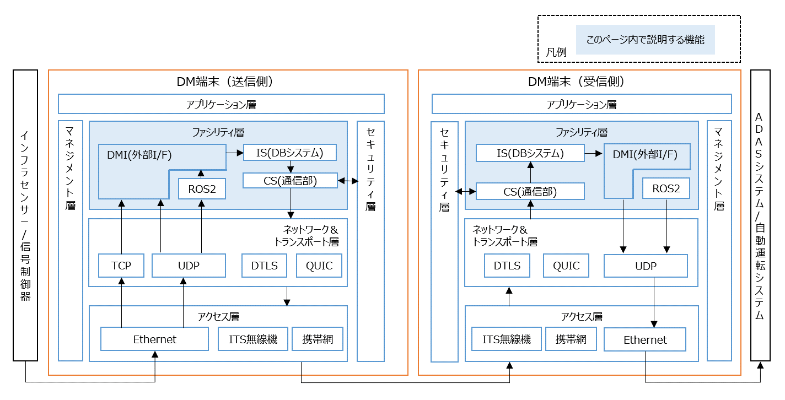

# DM Interface (外部とのインタフェース)

---

## 概要

- インフラセンサーや車載センサーの情報をDM2.0 Platformを介して、通信を行うために必要なC++ライブラリおよびモジュール。
- ROS2 / UDPでセンサーの情報を送信する準備ができている、あるいはご自身のROS2 / UDPアプリとDM2.0 Platformの接続を試したい人向けのドキュメントになります。
- もし通信プラットフォームの中身を知りたい方は、先に[dm2のインストール](../dm2/README.md)を参照して下さい。
- LiDARやカメラ等のセンサーと組み合わせて使う時のメッセージは物標情報 (object_info)、信号制御器と組み合わせて使うのメッセージは信号情報（singal_info）となります。メッセージ仕様の詳細が知りたい方は、[CooL4 API仕様](https://www.road-to-the-l4.go.jp/activity/theme04/pdf/CooL4_DataIntegrationPF_API_Spec_v100.pdf)を参照して下さい。


---


## 動作確認環境

### ネイティブ環境（非Docker）

| OS | 状態 |
|----|------|
| Ubuntu 20.04 | ✅ 動作確認済み |
| Ubuntu 22.04 | ⚠ 未検証 |
| Ubuntu 24.04 | ⚠ 未検証 |

---

### Docker環境

| 項目 | 状態 |
|------|------|
| Ubuntu 20.04 | ✅ 動作確認済み |
| Ubuntu 22.04 | ✅ 動作確認済み |
| Ubuntu 24.04 | ⚠ 未検証 |

---

### ROS対応

| ROS | OS | 状態 |
|-----|----|------|
| foxy | Ubuntu 20.04 | ✅ 動作確認済み |

## Dockerイメージの構築

- Ubuntu 20.04環境を用意します。約 20GB 程の空き容量が必要です。

- リポジトリのルートディレクトリ上で下記のコマンドを実行して下さい。DMIおよびIS、CS全てがDockerイメージとして構築されます。

```bash
bash build.bash
```

- イメージ構築後は、docker runコマンドを使って試すことができますが、[使用例](../example/README.md)はネイティブ環境（非Docker）でのコマンド例となるため、~/.bashrcに下記の関数を追記しておくことで、手動インストールとの差異を無くす事ができます。`-v`は、「コンテナ間で設定ファイルやログ、FDファイルを共有するためのオプション」です。`PROJECT_DIR`は、適宜、書き換えて下さい。
- `ROS_DOMAIN_ID`と`RMW_IMPLEMENTATION`は、ROS2通信を行うために必要です。`<domain_id>`は、適宜、書き換えて下さい。ROS2通信が不要なら、設定不要です。

```bash
PROJECT_DIR=~/dm20
function dm2cs_send () {
  docker run -it --init --rm --net host --name cs_send -v ${PROJECT_DIR}/dm2/conf:/tmp/conf dm2/cs:20.04 dm2cs_send -d /tmp/conf;
}
function dm2cs_recv () {
  docker run -it --init --rm --net host --name cs_recv -v ${PROJECT_DIR}/dm2/conf:/tmp/conf dm2/cs:20.04 dm2cs_recv -d /tmp/conf;
}
function dm2is () {
  docker run --init --rm --net host --name rdb -e POSTGRES_PASSWORD=postgres dm2/rdb:20.04 > /dev/null 2>&1 &
  docker run -it --init --rm --net host --name is -e ROS_DOMAIN_ID=<domain_id> -e RMW_IMPLEMENTATION=rmw_cyclonedds_cpp -v ${PROJECT_DIR}/dm2/conf:/tmp/conf dm2/is:20.04 dm2is -d /tmp/conf
}
function dm2mes () {
  docker run -i --rm --net host dm2/dm2mes:20.04 stdbuf -oL dm2mes "$@";
}
```

### マルチキャストが制限されているネットワーク環境の中でROS2通信を利用したい場合

- 上記、`docker run dm2/is:20.04`コマンドの中で、`-e`オプションを使って、`CYCLONEDDS_URI` の設定が必要になる場合があります。

## 例

- [ROS2トピックとDM2.0 Platformを連携する方法の例は、こちら](../example/ros2/object_info.md)
- [UDPデータとDM2.0 Platformを連携する方法の例は、こちら](../example/udp/sample.md)
