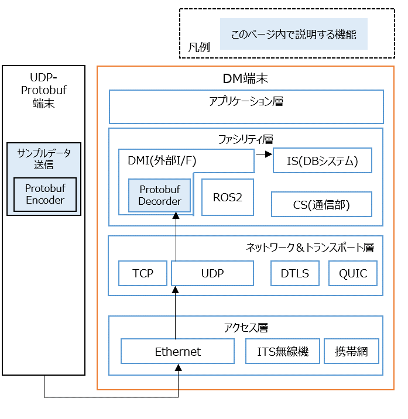

# センサー仕様に基づくProtobufデータ作成

## 概要

[ITS Japan 自動運転研究会 CCAM検討SWG共通の路側機センサー部インタフェース仕様](https://www.road-to-the-l4.go.jp/activity/theme04/pdf/CooL4_SensorInterfaceSpecification_v100.pdf)に基づき、Protobufデータを作成・送信するプログラムです。

Protobuf形式にエンコード・デコードするライブラリが含まれており、PROTOBUF_DMIでも利用します（図中のProtobuf Encoder / Decorder）




取り扱うProtobufの構造については、[sensor_io.proto](schema/sensor_io.proto)ファイルを参照して下さい。

上記は、[ITS Japan 自動運転研究会 CCAM検討SWG共通の路側機センサー部インタフェース仕様](https://www.road-to-the-l4.go.jp/activity/theme04/pdf/CooL4_SensorInterfaceSpecification_v100.pdf)の付録 B.「Protocol Buffersのメッセージ定義」と同等のものです。

## 動作確認環境

Ubuntu 20.04, Ubuntu 22.04, Ubuntu 24.04

### 依存ライブラリのインストール

```bash
sudo apt update

sudo apt install -y \
  cmake \
  libgoogle-glog-dev \
  libgflags-dev \
  libboost-all-dev
```

Protobufのインストール方法について、動作環境によって異なります。

- Ubuntu 24.04の場合は下記の通り、aptで入手できます。

```bash
sudo apt install -y \
  protobuf-compiler libprotobuf-dev
sudo ldconfig
```

- Ubuntu 20.04 / Ubuntu 22.04の場合は、下記の通り、公式サイトから Ver. 21.12 を入手し、インストールして下さい。

```bash

wget https://github.com/protocolbuffers/protobuf/releases/download/v21.12/protobuf-cpp-3.21.12.tar.gz
tar zxvf protobuf-cpp-3.21.12.tar.gz
cd protobuf-3.21.12
./configure
make -j$(nproc)
sudo make install
sudo ldconfig
```

### ビルド

本ディレクトリ上で下記のコマンドを実行して下さい。あるいは、本ディレクトリをワークディレクトリにコピーした上でビルドしても問題ありません。

```bash
mkdir build
cd build
cmake ..
make -j4
sudo make install
sudo ldconfig
```

下記のログが表示されていれば、ビルド完了です。

```
-- Installing: /usr/local/bin/ccam_cool4_sensor_io_sample_send_msg
-- Installing: /usr/local/bin/ccam_cool4_sensor_io_sample_recv_msg
(略)
-- Installing: /usr/local/share/cmake/ccam_cool4_sensor_io/ccam_cool4_sensor_io-config-noconfig.cmake
```

## 動作確認

受信プログラムを起動します。
```bash
ccam_cool4_sensor_io_sample_recv_msg  --v 1 --port 51234
```

送信プログラムを起動します。
```bash
ccam_cool4_sensor_io_sample_send_msg --v 1 --port 51234 --rate_msec 100 --ipaddr 127.0.0.1
```

受信側の標準出力に下記ログが確認できます。

```text
I0603 01:47:00.783284 1103445 receiver.hpp:60] len: 485
I0603 01:47:00.883445 1103445 receiver.hpp:60] len: 485
```

受信プログラムの引数 `--v` を `2` にすることで、受信データの中身を表示することもできます。
```bash
ccam_cool4_sensor_io_sample_recv_msg  --v 2 --port 51234
```

- 表示例（抜粋）
```text
  confidence: 31
  detectable_size: 32
```

## 応用例

- [Protobufのサンプルデータ生成ツールを使って、DM2.0 Platformとの連携を確認する](../../../example/protobuf/README.md)

