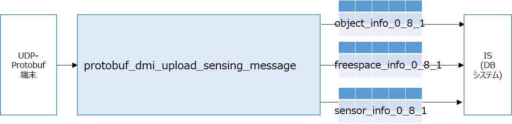

# Protobuf DM Interface (センサー仕様に基づくProtobufデータとのインタフェース)

## 概要

[ITS Japan 自動運転研究会 CCAM検討SWG共通の路側機センサー部インタフェース仕様](https://www.road-to-the-l4.go.jp/activity/theme04/pdf/CooL4_SensorInterfaceSpecification_v100.pdf)に基づき、作成されたProtobufデータ送信プログラムとDM2.0の間に立ち、データの相互変換を行います。





取り扱うProtobufの構造については、[sensor_io.proto](../ccam_cool4_sensor_io/schema/sensor_io.proto)ファイルを参照して下さい。

上記は、[ITS Japan 自動運転研究会 CCAM検討SWG共通の路側機センサー部インタフェース仕様](https://www.road-to-the-l4.go.jp/activity/theme04/pdf/CooL4_SensorInterfaceSpecification_v100.pdf)の付録 B.「Protocol Buffersのメッセージ定義」と同等のものです。

## 動作確認環境

Ubuntu 20.04, Ubuntu 22.04, Ubuntu 24.04

### dm2 のインストール

- [dm2のインストール](../../dm2/README.md)が必要になります。

### ccam_cool4_sensor_io のインストール

- [ccam_cool4_sensor_ioのインストール](../ccam_cool4_sensor_io/README.md)が必要になります。

### PROTOBUF_DMI 依存ライブラリのインストール

dm2, ccam_cool4_sensor_ioをインストールしていれば、その他の依存ライブラリは必要ありません。

### ビルド

本ディレクトリ上で、下記のコマンドを実行して下さい。

```bash
mkdir build
cd build
cmake ..
make -j4
sudo make install
sudo ldconfig
```

下記のログが表示されていれば、ビルド完了です。

```
-- Installing: /usr/local/bin/protobuf_dmi_upload_sensing_message
(略)
-- Installing: /usr/local/share/cmake/protobuf_dmi/protobuf_dmi-config-noconfig.cmake
```

## 動作確認

下記を参考にして下さい。

- [Protobufのサンプルデータ生成ツールを使って、DM2.0 Platformとの連携を確認する](../../../example/protobuf/README.md)

