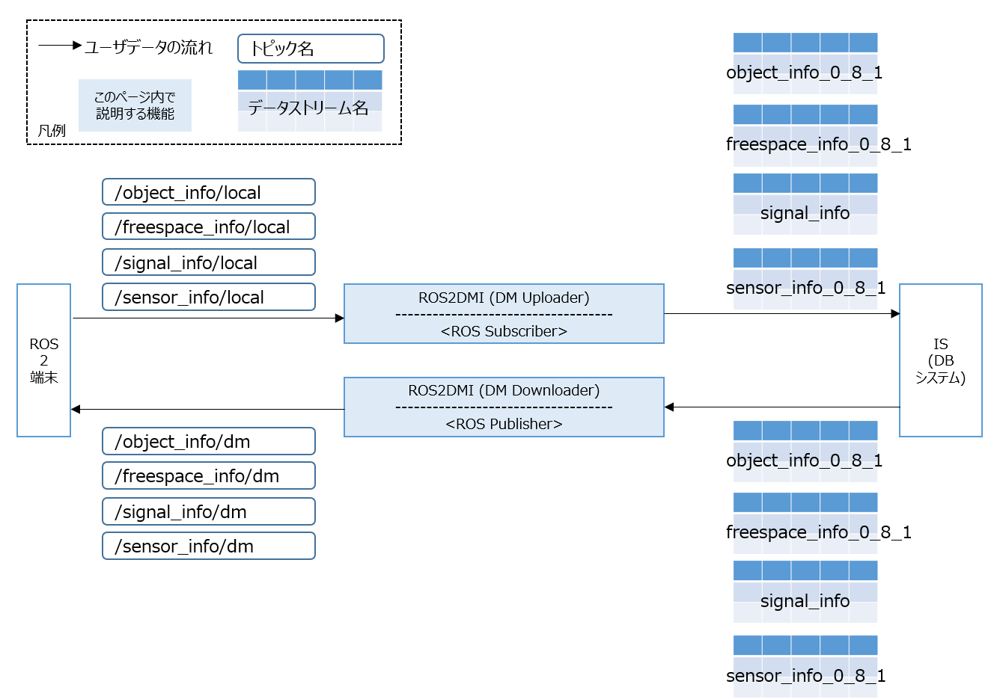

# ROS2 DM Interface (ROS2とのインタフェース)

## 概要

ROS2とDM2.0の間に立ち，データの相互変換を行います。

- Uploader

  ROS2 messageをSubscribeし、DM2.0に対応した形式（データストリーム）に変換しDBシステムへ送信します。

- Downloader

  DM2.0からデータストリームを受信し、ROS2 messageとしてPublishします。



対応するROS2 messageは、[CooL4 API仕様](https://www.road-to-the-l4.go.jp/activity/theme04/pdf/CooL4_DataIntegrationPF_API_Spec_v100.pdf)に基づき作成されています。

API仕様上での情報名、DM2.0上で流れるデータストリーム、ROS2 message、実際にROS2上で流れるトピック（Uploader側 / Downloader側）の一覧を以下に示します。

| API仕様上での情報名 | データストリーム名 | ROS2 message型 | UploaderがSubscribeするトピック名 | DownloaderがPublishするトピック名 |
| ---- | ---- | ---- | ---- | ---- |
| 物標情報 | object_info_0_8_1 | dm_object_info_msgs/ObjectInfoArray | /object_info/local | /object_info/dm |
| フリースペース情報 | freespace_info_0_8_1 | dm_freespace_info_msgs/FreespaceInfoArray | /freespace_info/local | /freespace_info/dm |
| 信号情報 | signal_info | dm_signal_info_msgs/SignalInfoArray | /signal_info/local | /signal_info/dm |
| センサー情報 | sensor_info_0_8_1 | dm_sensor_info_msgs/SensorInfoArray | /sensor_info/local | /sensor_info/dm |

- ROS2 messageの定義ファイルは，[dm_msgsディレクトリを参照](dm_msgs/)
- DM2.0上で流れるデータストリームの定義は、[schemaディレクトリを参照](../../dm2/conf/schema/)

## 動作確認環境

- Ubuntu 20.04, Ubuntu 22.04, Ubuntu 24.04
- ROS2 Foxy, Humble, Jazzy

## 導入手順

### ROS2 のインストール

Ubuntu LTSのOSのバージョンに合わせて、ROS2をインストールして下さい。

| OS | ROS2 | インストール手順（URL） |
|---|---|---|
| Ubuntu 20.04 | Foxy | https://docs.ros.org/en/foxy/Installation/Ubuntu-Install-Debians.html |
| Ubuntu 22.04 | Humble | https://docs.ros.org/en/humble/Installation/Ubuntu-Install-Debs.html |
| Ubuntu 24.04 | Jazzy | https://docs.ros.org/en/jazzy/Installation/Ubuntu-Install-Debs.html |


下記 help コマンドを実行し、エラーがない事を確認して下さい。ros_distroの値は、インストールしたバージョンに合わせて、`foxy`, `humble`, `jazzy`いずれかの値を入れて下さい。

```bash
source /opt/ros/<ros_distro>/setup.bash
ros2 -h
```

### dm2 のインストール

- [dm2のインストール](../../dm2/README.md)が必要になります。

### ROS2DMI 依存ライブラリのインストール

```bash
sudo apt update

sudo apt install -y \
  cmake \
  libgoogle-glog-dev \
  libgflags-dev \
  libboost-all-dev \
  python3-colcon-common-extensions
```

[dm2の依存ライブラリ](../../dm2/README.md#依存ライブラリのインストール)と共通の箇所は省略しています。

### ビルド

リポジトリのルートディレクトリ/dmi/ros2上で下記のコマンドを実行して下さい。

```bash
source /opt/ros/<ros_distro>/setup.bash
colcon build --symlink-install
```

最後に下記のログが表示されていれば、ビルド完了です。ワーニングは無視して問題ありません。

```
Finished <<< ros2_dmi [14.6s]
Summary: 5 packages finished
```

## 動作確認

下記を参考にして下さい。

- [ROS2トピックとDM2.0 Platformを連携する方法の例は、こちら](../../example/ros2/object_info.md)
