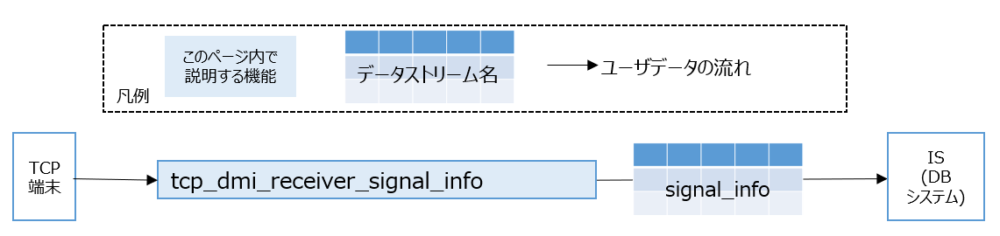

# TCP DM Interface (TCPとのインタフェース)

## 概要

TCP送信プログラムとDM2.0の間に立ち，データの変換を行います。

- Uploader

  バイナリ型のTCPパケットを受信し、DM2.0に対応した形式（データストリーム）に変換しDBシステムへ送信します。




対応するバイナリ型のTCPパケットは、[CooL4 API仕様](https://www.road-to-the-l4.go.jp/activity/theme04/pdf/CooL4_DataIntegrationPF_API_Spec_v100.pdf)に基づき作成されています。

API仕様上での情報名、DM2.0上で流れるデータストリーム、対応するTCP受信/送信プログラム、デフォルトで使用するポート番号を下記の表にまとめます。

| API仕様上での情報名 | データストリーム名 | TCP受信プログラム | デフォルトで使用するポート番号（変更可） |
| ---- | ---- | ---- | ---- |
| 信号情報 | signal_info | tcp_dmi_receiver_signal_info | 54347 |

信号情報のTCPパケットの構造はUDPパケットと共通になります。以下を参照して下さい。

- [Excel形式でまとめたフォーマット説明書](../../../docs/xlsx/UDPDMIデータフォーマット説明書_1.0.0.xlsx)
- [yaml形式で定義した信号情報](../../../docs/yamls/signal_info.yaml)

## 動作確認環境

Ubuntu 20.04, Ubuntu 22.04, Ubuntu 24.04

### dm2 のインストール

- [dm2のインストール](../../dm2/README.md)が必要になります。

### TCP_DMI 依存ライブラリのインストール

```bash
sudo apt update

sudo apt install -y \
  cmake \
  libgoogle-glog-dev \
  libgflags-dev \
  libboost-all-dev
```

[dm2の依存ライブラリ](../../dm2/README.md#依存ライブラリのインストール)と共通の箇所は省略しています。

### ビルド

リポジトリのルートディレクトリ/dmi/udptcp上で下記のコマンドを実行して下さい。

```bash
bash build_tcp_dmi.bash
```

`build_udp_dmi.bash` の中身は、下記の通り、必要なライブラリである `cool4_api_dataclass`, `dmi_utils` と、`tcp_dmi` 本体のビルド・インストールをしています。

```bash
set -e 
for dir in cool4_api_dataclass dmi_utils tcp_dmi; do 
  cd ${dir} 
  echo "try to build ${dir}" 
  rm -rf build 
  mkdir build 
  cd build 
  cmake .. 
  make -j$(nproc) 
  sudo make install 
  sudo ldconfig
  cd ../..
done
```

下記のログが表示されていれば、ビルド完了です。ワーニングは無視して問題ありません。

```
[100%] Built target tcp_dmi_receiver_signal_info
Install the project...
-- Install configuration: ""
-- Installing: /usr/local/include/tcp_dmi
(略)
-- Installing: /usr/local/share/cmake/tcp_dmi/tcp_dmi-config-noconfig.cmake
```

## 動作確認

下記を参考にして下さい。

- [TCPのサンプルデータ生成ツールを使って、DM2.0 Platformとの連携を確認する](../../../example/tcp/README.md)

