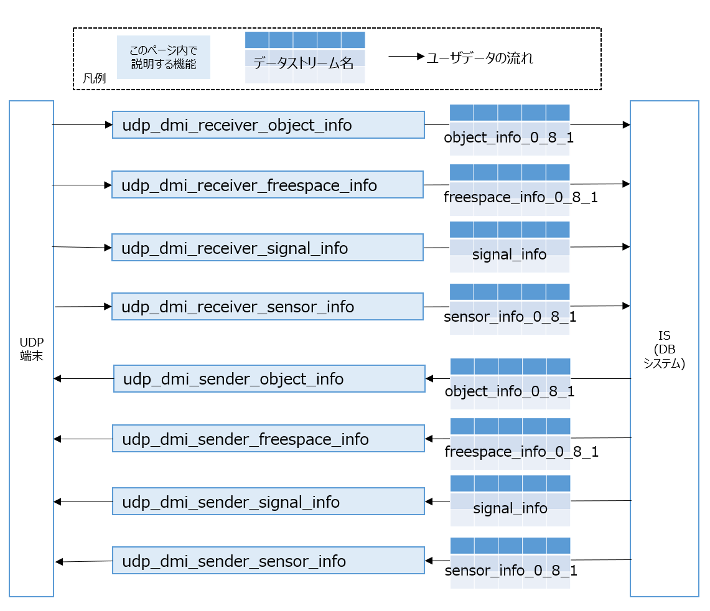

# UDP DM Interface (UDPとのインタフェース)

## 概要

UDP送受信プログラムとDM2.0の間に立ち，データの相互変換を行います。

- Uploader

  バイナリ型のUDPパケットを受信し、DM2.0に対応した形式（データストリーム）に変換しDBシステムへ送信します。

- Downloader

  DM2.0からデータストリームを受信し、バイナリ型のUDPパケットに変換し送信します。




対応するバイナリ型のUDPパケットは、[CooL4 API仕様](https://www.road-to-the-l4.go.jp/activity/theme04/pdf/CooL4_DataIntegrationPF_API_Spec_v100.pdf)に基づき作成されています。

API仕様上での情報名、DM2.0上で流れるデータストリーム、対応するUDP受信/送信プログラム、デフォルトで使用するポート番号を下記の表にまとめます。

| API仕様上での情報名 | データストリーム名 | UDP受信プログラム | UDP送信プラグラム | デフォルトで使用するポート番号（変更可） |
| ---- | ---- | ---- | ---- | ---- |
| 物標情報 | object_info_0_8_1 | udp_dmi_receiver_object_info | udp_dmi_sender_object_info | 54345 |
| フリースペース情報 | freespace_info_0_8_1 | udp_dmi_receiver_freespace_info | udp_dmi_sender_freespace_info | 54346 |
| 信号情報 | signal_info | udp_dmi_receiver_signal_info | udp_dmi_sender_signal_info | 54347 |
| センサー情報 | sensor_info_0_8_1 | udp_dmi_receiver_sensor_info | udp_dmi_sender_sensor_info | 54348 |

各情報毎のUDPパケットの構造について知りたい場合は、以下を参照して下さい。

- [Excel形式でまとめたフォーマット説明書](../../../docs/xlsx/UDPDMIデータフォーマット説明書_1.0.0.xlsx)
- [yaml形式で定義したファイル格納場所](../../../docs/yamls/)

## 動作確認環境

Ubuntu 20.04, Ubuntu 22.04, Ubuntu 24.04

### dm2 のインストール

- [dm2のインストール](../../dm2/README.md)が必要になります。

### UDP_DMI 依存ライブラリのインストール

```bash
sudo apt update

sudo apt install -y \
  cmake \
  libgoogle-glog-dev \
  libgflags-dev \
  libboost-all-dev
```

[dm2の依存ライブラリ](../../dm2/README.md#依存ライブラリのインストール)と共通の箇所は省略しています。

### ビルド

リポジトリのルートディレクトリ/dmi/udptcp上で下記のコマンドを実行して下さい。

```bash
bash build_udp_dmi.bash
```

下記のログが表示されていれば、ビルド完了です。ワーニングは無視して問題ありません。

```
[100%] Built target udp_dmi_receiver_sensor_info
Install the project...
-- Install configuration: ""
-- Installing: /usr/local/lib/libudp_dmi.so
(略)
-- Installing: /usr/local/share/cmake/udp_dmi/udp_dmi-config-noconfig.cmake
```

## 動作確認

下記を参考にして下さい。

- [UDPのサンプルデータ生成ツールを使って、DM2.0 Platformとの連携を確認する](../../../example/udp/README.md)

