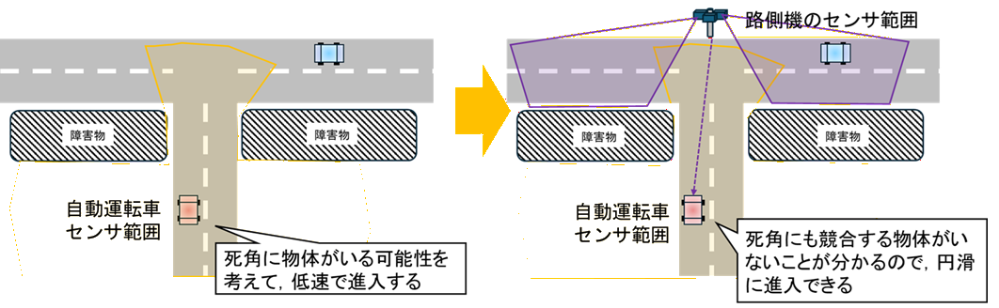
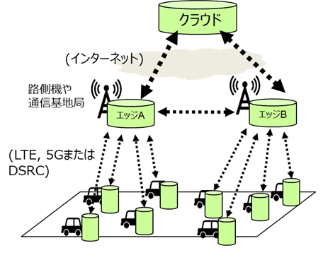

# DM2.0 Platform 開発の背景

---

近年、自動運転システムや高度安全運転支援システムの開発・普及が進んだことにより、高精度なセンサと通信装置を積んだ車両が街中を走行することが多くなってきています。
しかし、単独のセンサではカバーできる範囲に限りがあり、さらに街中にはセンサを遮る障害物も多いため、車両単体で観測できる領域は十分広いとは言えません。
そこでさらなる円滑な走行や交通安全の実現には、車両同士や道路インフラ装置との間で通信を行って、複数のセンサの情報を交換・共有することで、認識できる範囲をお互いに拡張することが重要になってきています。

センサが検知し、通信によって共有された情報は、まだ単独では交通ルール上の意味が与えられていません。
高精度道路地図や信号情報などの他の情報と組み合わせて理解することで、初めて物体と車線や物体同士の交通ルール上の関係を解釈できるようになります。
センサなどの情報を高精度道路地図上で意味付けして検索・統合利用できるようにしたシステムは、「ダイナミックマップ」と呼ばれています。
ダイナミックマップは、自動運転等の高度な交通サービスを支える上で必要な情報基盤と位置づけられており、世界的にも業界団体を中心に通信で共有されたセンサなどの情報と高精度道路地図を扱う仕組みが検討されています。

我々のプロジェクトでは、2016年度から次世代のダイナミックマップの研究開発を続けてきました。
その成果物である「ダイナミックマップ2.0プラットフォーム（DM2.0PF）」は、車載システムやスマートフォン等の組込み環境、道路脇の路側機・通信基地局などのエッジ環境、データセンターのクラウド環境の、三階層にまたがった通信連携を行う分散データベースシステムとして実現されました。

従来のサーバ/クライアント構成では，情報の共有のためにクラウドを利用することになりますが、クラウドへの往復で発生する通信遅延や処理負荷の一極集中の問題が避けられません。
それに対して路側機や通信基地局などのエッジによる局所的な情報共有では、より少ない通信遅延で地理的なデータ局所性を活かしたやり取りが可能です。

