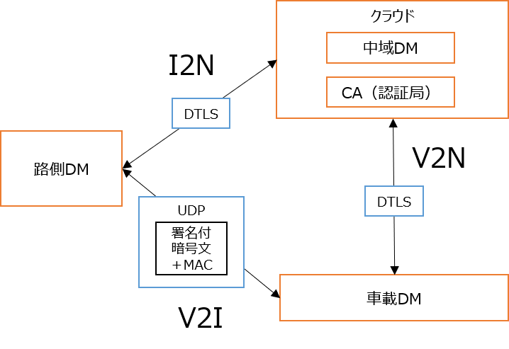

# セキュリティの仕組みを理解する
---

- DM2.0 Platform内のセキュリティの仕組みについて説明します。下記の図は、実装イメージおよび通信内容を示した一例になります。

---

- V2N・I2Nにおいて、携帯網を利用した1対1通信が基本となるため、リアルタイム性と暗号化を両立させるため、Datagram Transport Layer Security (DTLS) を採用しています。
- V2Iでブロードキャスト通信を行う場合においても、TLS同等の機能を得るために、独自にPKIを用意し、UDPデータを暗号化・署名付与しています。

## セキュリティに関する設定・操作
- [DTLS通信を使う](../example/security/dtls.md)
- [UDP(暗号化あり)通信を使う](../example/security/udp_cipher.md)
- [UDP(暗号化あり・署名あり)通信を使う](../example/security/udp_pki.md)

## 将来の拡張について
- V2N・I2Nにおいて、将来的には、QUICのサポートを予定しています。
- V2Iにおいては、追跡防止のために定期的にID・証明書を交換する仕組みが必要です。実証実験で用いたサンプルをリリースする準備を進めています。