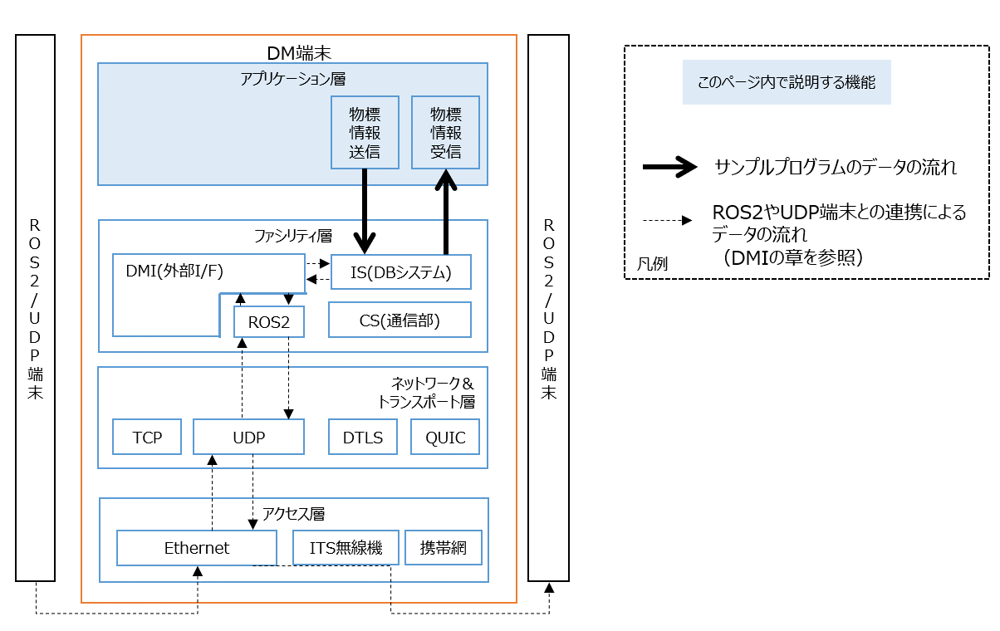

# サンプルアプリケーションを使う

# はじめに

本章では、DM2.0 Platform 内部で動作するアプリケーション開発を目的として、サンプルプログラムの構成および動作を説明します。

ROS2DMI や UDPDMI は、ROS2 や UDP を用いて外部端末とデータ連携を行う機能ですが、本サンプルではそれらとは区別し、DM2.0 Platform 内部で動作するアプリケーションを対象としています。

本サンプルを通じて、DM2.0 Platform 内部で利用される DM ライブラリ(API) の基本的な使用方法を理解できます。

理解を深めていく事で、以下のような内部データ処理アプリケーションを開発できるようになります。

- ROS2 や UDP から受信したデータをクエリでフィルタリングする
- データ加工を行う
- 統計処理や集計処理を行う
- ストリームデータを別のストリームに変換し送信する


---

# 前提条件

[dm2](../../dm2/README.md)がインストール済みである事が前提です。

# サンプルプログラム

本章では、以下のサンプルプログラムを扱います。

- DM2.0 Platform の DB システムへ物標情報を送信する
    - [送信サンプルプログラム](send_object_info/send_object_info.cpp)
    - [送信API説明付き](send_object_info/README.md)

- DM2.0 Platform の DB システムから Query を用いて物標情報を受信する
    - [受信サンプルプログラム](recv_object_info/recv_object_info.cpp)
    - [受信API説明付き](./recv_object_info/README.md)

# サンプルプログラム動作手順

## 1. DBシステム起動

まず、DM2 DBシステムを起動します。

```bash
dm2is -d ~/dm20/dm2/conf
```

`-d` オプションには、リポジトリのルートディレクトリ配下の `dm2/conf` ディレクトリを指定してください。

起動後、DBシステムが待受状態になります。

---

# 2. 送信プログラムビルド

```bash
g++ -std=c++14 send_object_info.cpp \
    -lxerces-c \
    -ldmclient \
    -ltuple \
	-ldm2proto_is \
	-ldm2proto_api \
	-lprotobuf \
    -lcrypto \
    -lssl \
    -lz \
    -lzstd \
    -lgeos_c \
    -pthread \
    -o send_object_info.out
```

ビルド成功後、以下実行ファイルが生成されます。

```text
send_object_info.out
```

---

# 3. 受信プログラムビルド

```bash
g++ -std=c++14 recv_object_info.cpp \
    -lxerces-c \
    -ldmclient \
    -ltuple \
	-ldm2proto_is \
	-ldm2proto_api \
	-lprotobuf \
    -lcrypto \
    -lssl \
    -lz \
    -lzstd \
    -lgeos_c \
    -pthread \
    -o recv_object_info.out
```

ビルド成功後、以下実行ファイルが生成されます。

```text
recv_object_info.out
```

---

# 4. 受信プログラム実行

まず、受信側を起動します。

```bash
./recv_object_info.out
```

受信プログラムは、`object_info_0_8_1` ストリームを購読状態にして待機します。

---

# 5. 送信プログラム実行

次に、別ターミナルで送信プログラムを起動します。

```bash
./send_object_info.out
```

送信プログラムは、一定周期で物標情報を送信します。

---

# 動作確認

送信プログラム起動後、受信側ターミナルに以下のようなデータが表示されます。

```text
1,1,1,1,1,1,1,...
2,2,2,2,2,2,2,...
3,3,3,3,3,3,3,...
```

これは、送信プログラムが `object_info_0_8_1` ストリームへ送信したデータを、受信プログラムが正常に受信できていることを示しています。

---

# 停止方法

各プログラムは `Ctrl + C` で停止できます。

停止順序例:

1. send_object_info.out 停止
2. recv_object_info.out 停止
3. dm2is 停止

---
