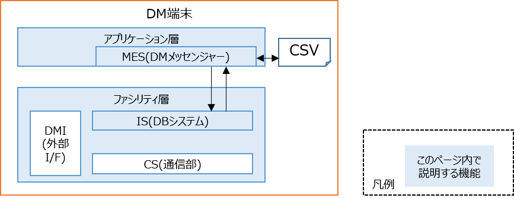
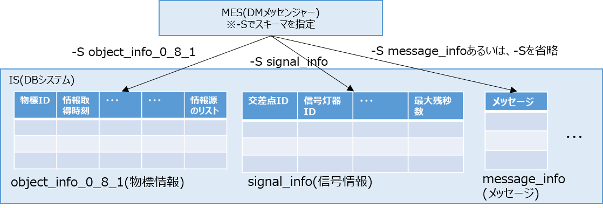

# 1端末上でDBシステムの入出力の動作を確認する

標準でインストールされているアプリケーションであるDMメッセンジャーを使って、DBシステムの入出力の動作を確認できます。


---

## コマンド実行の流れ
---

1. DBシステムを起動します。引数にはリポジトリのルートディレクトリ/dm2/confディレクトリを指定して下さい。

```bash
dm2is -d ~/dm20/dm2/conf
```

- DBシステムが起動します。初期状態は100ミリ秒と1秒周期のタイマーのみ起動している状態です。

```text
[INFO] Config Directory set from arg [-d]
2026-03-20 10:08:33,396 0x7f86c4d1f9c0  INFO Main - ===== DM2.0PF DB SYSTEM START =====
2026-03-20 10:08:33,398 0x7f8697fff700  INFO QueryExecuter - MNGID:1, destSID:0, QUERY:CREATE STREAM sysTimer100msec (time long) TIMER_FIX [100]
2026-03-20 10:08:33,399 0x7f86977fe700  INFO QueryExecuter - MNGID:2, destSID:0, QUERY:CREATE STREAM sysTimer1000msec (time long) TIMER_FIX [1000]
```

2. 別ターミナルでDMメッセンジャーを受信モード（`-r`）で起動します。confディレクトリの指定は不要です。
```bash
dm2mes -r
```

3. 別ターミナルでDMメッセンジャーを送信モードで起動します
```bash
echo hello, dm2 | dm2mes
```

4. 受信モードのターミナル上にhello, dm2が表示されます。
```text
hello, dm2
```

### 環境変数の設定

- DBシステム（dm2is）について、`-d`で引数を指定せずに実行したい場合は、下記のようにconfディレクトリを環境変数として登録します。
```bash
export DM2_CONF_DIR_PATH=~/dm20/dm2/conf
```
セッションを閉じると、再度実行が必要になります。永続化するためには、下記の設定が必要です。
```bash
echo 'export DM2_CONF_DIR_PATH=~/dm20/dm2/conf' >> ~/.bashrc
source ~/.bashrc
```

### スキーマについて

- DMメッセンジャーで特定のストリーム型DBを送受信するには、上記手順2において、`-S`でスキーマ名を指定します。

```bash
dm2mes -r -S object_info_0_8_1
```

- スキーマによって、属性（下記表の列）の数や属性の型（例：数値型、文字列型、配列）等が異なります。`-S`を指定しない場合は、文字列型1列の属性を持つ message_info となります。



- [CooL4 API仕様](https://www.road-to-the-l4.go.jp/activity/theme04/pdf/CooL4_DataIntegrationPF_API_Spec_v100.pdf)で定義されているスキーマは全てサポートしています。上記の例では、センサーが検出した物標情報を格納するスキーマ object_info_0_8_1 を指定しています。下記のように、100件のテストデータ rows_100.csv を、100ミリ秒間隔で、物標情報としてDBシステムに送信することで、受信モードのターミナル上に100件のデータが100ミリ秒間隔で表示されます。
```bash
cat ~/dm20/example/command/test_data/object_info_0_8_1/rows100.csv | dm2mes -S object_info_0_8_1 -d 100
```

- 結果
```text
1,620002823524,...,[2]
2,620002823624,...,[2]
...
100,620002833424,...,[2]
```
