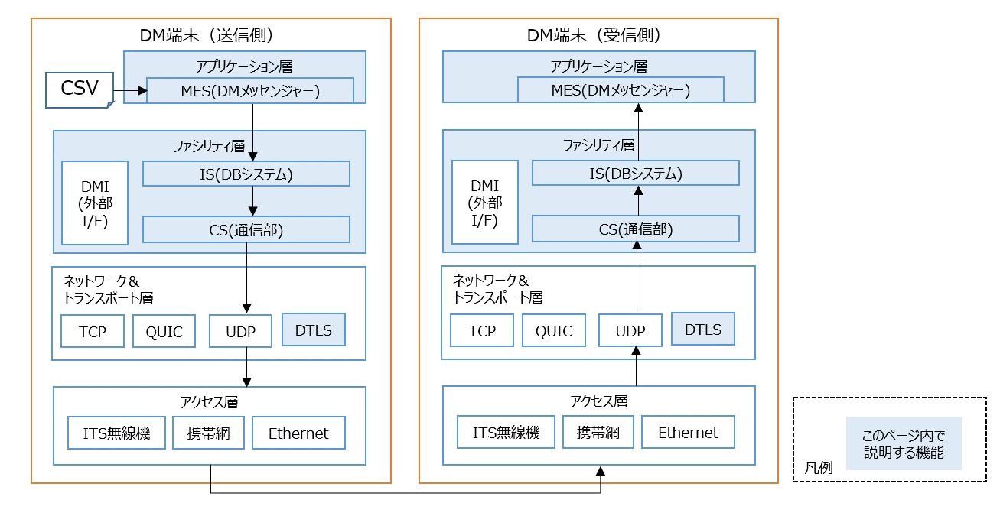

# 2端末上でUDP(暗号化なし)通信を使って、ストリームデータを送受信する

2端末を使った入出力の動作を確認できます。[1端末の例](../01_dm2is_to_dm2mes/README.md)で使ったDMメッセンジャーを使って、CSVファイルに保存されている擬似的なストリームデータを送信側のDM端末から受信側のDM端末へとUDPで送信します。


---

## コマンド実行の流れ
---

- 送信側・受信側それぞれで通信に使用するNIC名とIPアドレスを覚えておきます。
```bash
  ip a
```
```text
1: eth0
    inet 192.168.1.2/24
```

---
- 受信側で、リポジトリのルートディレクトリ/dm2/confディレクトリにある[dm2.conf](../../../dm2/conf/dm2.conf)を編集します。


### 受信側のconf/dm2.conf
MY_STATION_IDは、送信側のMY_STATION_IDと異なる値を入れて下さい。
INTERFACE_NAME_1は、受信側のNIC名をセットして下さい。

```text
MY_STATION_ID = 2
INTERFACE_NAME_1 = eth0
INTERFACE_IP_VER_1 = 4
UDP_PORT_NUMBER_1 = 55555
SOCKET_TYPE_1 = udp
```

- 送信側で、リポジトリのルートディレクトリ/dm2/confディレクトリにある[dm2.conf](../../../dm2/conf/dm2.conf), [send_list_v4.csv](../../../dm2/conf/send_list_v4.csv), [transfer-object_info_0_8_1.xml](../../../dm2/conf/presetQuery/sample/transfer-object_info_0_8_1.xml)を編集します。

### 送信側のconf/dm2.conf
MY_STATION_IDは、受信側のMY_STATION_IDと異なる値を入れて下さい。
INTERFACE_NAME_1は、送信側のNIC名をセットして下さい。

```text
MY_STATION_ID = 1
INTERFACE_NAME_1 = eth0
INTERFACE_IP_VER_1 = 4
UDP_PORT_NUMBER_1 = 55555
SOCKET_TYPE_1 = udp
```

### 送信側のconf/send_list_v4.csv
受信側のMY_STATION_IDと、IPアドレスを設定して下さい。
```text
2, 192.168.1.2
```

### 送信側のconf/presetQuery/sample/transfer-object_info_0_8_1.xml
`<destination>`タグに受信側のMY_STATION_IDを設定して下さい。
```text
<?xml version="1.0" encoding="UTF-8" standalone="yes"?>
<query>
	<destination>2</destination>
	<body>MASTER object_info_0_8_1 SELECT * FROM object_info_0_8_1 [rows 50]</body>
	<!-- retry life_time="60" /> -->
</query>
```
編集後は、`conf/presetQuery/sample/transfer-object_info_0_8_1.xml`を`conf/presetQuery`直下に移動して下さい。

- DBシステムと通信部を起動します。引数にはリポジトリのルートディレクトリ/dm2/confディレクトリを指定するか、環境変数DM2_CONF_DIR_PATHを設定して下さい。環境変数の設定方法について詳しく知りたい場合は[こちら](../01_dm2is_to_dm2mes/README.md#環境変数の設定)

### 送信側のターミナル1
- 通信部の送信モジュールを起動します。confディレクトリのパス指定に誤りがある場合は、終了します。
```bash
dm2cs_send -d ~/dm20/dm2/conf
```

### 送信側のターミナル2
- DBシステムを起動します。confディレクトリのパス指定に誤りがある場合は、終了します。
```bash
dm2is -d ~/dm20/dm2/conf
```

### 受信側のターミナル1
- 通信部の受信モジュールを起動します。confディレクトリのパス指定に誤りがある場合は、終了します。NIC名が誤っている場合は、抽出失敗のログが出るので、修正後、再起動して下さい。
```bash
dm2cs_recv -d ~/dm20/dm2/conf
```

### 受信側のターミナル2
- DBシステムを起動します。
```bash
dm2is -d ~/dm20/dm2/conf
```

- テストデータを使って、通信確認を行います。

---
### 受信側のターミナル3

- DMメッセンジャーで物標情報スキーマを指定して、受信待ちさせます。

```bash
dm2mes -r -S object_info_0_8_1
```

### 送信側のターミナル3

- 100件のテストデータ rows_100.csv を、100ミリ秒間隔で、物標情報としてDBシステムに送信することで、受信側のターミナル3上に100件のデータが100ミリ秒間隔で表示されます。

```bash
cat ~/dm20/example/command/test_data/object_info_0_8_1/rows100.csv | dm2mes -S object_info_0_8_1 -d 100
```

- 結果
```text
1,620002823524,...,[2]
2,620002823624,...,[2]
...
100,620002833424,...,[2]
```

