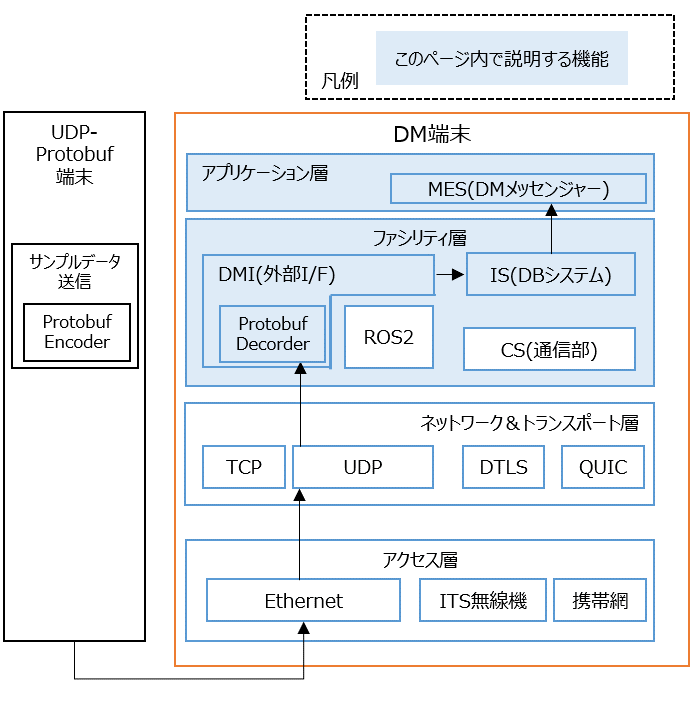

# Protobufのサンプルデータ生成ツールを使って、DM2.0 Platformとの連携を確認する
---
## 1. 概要
---

ProtobufでエンコードされたUDPデータを送信/受信する端末（UDP-Protobuf端末）とDM端末（DM2.0をインストールした端末）との連携動作を確認できます。

取り扱うProtobufの構造については、[sensor_io.proto](../../dmi/protobuf/ccam_cool4_sensor_io/schema/sensor_io.proto)ファイルを参照して下さい。

上記は、[ITS Japan 自動運転研究会 CCAM検討SWG共通の路側機センサー部インタフェース仕様](https://www.road-to-the-l4.go.jp/activity/theme04/pdf/CooL4_SensorInterfaceSpecification_v100.pdf)の付録 B.「Protocol Buffersのメッセージ定義」と同等のものです。



---

## 2 DM2.0 Platformの動作確認環境

Ubuntu 20.04, Ubuntu 22.04, Ubuntu 24.04

### Docker環境
- [dmiの動作確認環境](../../dmi/README.md#動作確認環境)を参照

## 3 導入手順

### 3.1 DM端末へdmiをインストール

- [dmiのインストール](../../dmi/README.md#dockerイメージの構築)を参照


### 3.2 DBシステム・DMIの起動

下記２パターンで起動方法が分かれます。

- [a. DBシステム・DMIをDockerイメージで構築した場合](#32a-dockerイメージで構築した場合の-dbシステムdmiの起動方法)
- [b. 手動インストールした場合（非Dockerの場合）](#32b-手動インストールでdbシステムとudp_dmiをインストールした場合の-dbシステムdmiの起動方法)

### 3.2.a Dockerイメージで構築した場合の DBシステム・DMIの起動方法
- [リポジトリのルートディレクトリ/dm2/conf/dmiConf.yml](../../dm2/conf/dmiConf.yml)を編集します。

```text
 protobuf:
   - message_type: SensingMessage
     type: receiver
     receive_port: 31876
     rsu_id: 0x12345678
     sensor_id: 0x1
```

DM2.0 PlatformのDBシステムを起動します。Dockerイメージで構築した場合のPROTOBUF_DMIは、DBシステム内から動的ライブラリとして呼び出されるため、起動コマンドはありません。

```bash
dm2is 
```
### 3.2.b 手動インストールでDBシステムとPROTOBUF_DMIをインストールした場合の DBシステム・DMIの起動方法

DM2.0 PlatformのDBシステムを起動します。引数にはリポジトリのルートディレクトリ/dm2/confディレクトリを指定して下さい。

```bash
dm2is -d ~/dm20/dm2/conf
```

別ターミナルでPROTOBUF_DMIのProtobuf-Receiver（DM2.0-uploader）を起動します。

```bash
protobuf_dmi_upload_sensing_message --dm_user dm2sampleuser --dm_pass dm2samplepassword --receive_port 31876 --rsu_id 0x12345678 --sensor_id 0x01
```


インストール方法は、[こちら](../../dmi/protobuf/ccam_cool4_sensor_io/README.md#依存ライブラリのインストール)

### 3.3 Protobufデータ受信待ち（DM端末側）

DM端末側で、DMメッセンジャーを受信モード（-r）で起動します。

Protobufのデータは、DBシステム内では、センサー情報・物標情報・フリースペース情報の3つに分かれるため、3つターミナルを起動し、それぞれ下記のコマンドを実行します。

```bash
dm2mes -r -S sensor_info_0_8_1
```
```bash
dm2mes -r -S object_info_0_8_1
```
```bash
dm2mes -r -S freespace_info_0_8_1
```

### 3.4 Protobufデータ生成・送信（UDP-Prrotobuf端末）

UDP-Prrotobuf端末に、[ITS Japan 自動運転研究会 CCAM検討SWG共通の路側機センサー部インタフェース仕様](https://www.road-to-the-l4.go.jp/activity/theme04/pdf/CooL4_SensorInterfaceSpecification_v100.pdf)に基づくデータを作成するプログラムをインストールし、下記コマンドを実行します。

```bash
ccam_cool4_sensor_io_sample_send_msg --port 31876 --rate_msec 100 --ipaddr <DM端末のIPアドレス>
```

インストール方法は[こちら](../../dmi/protobuf/ccam_cool4_sensor_io/README.md)

### 3.5 Protobufデータ受信確認（DM端末側）

受信モードの3つのターミナル上にデータが表示されます。

- センサー情報
  ```text
  305419896,1,0,6668,0,1,2,0,-132768,-132768,20001,0,-132768,-132768,20001,15,17,101,0,0,10001,0,-132768,-132768,-132768,4095,4095,28800,7201,707537877439,3,[4,6,8,10],[5,7,9,11],12,13,14,[15,17,19,21],[16,18,20,22],23,24,25,[26,28,30,32],[27,29,31,33],34,35,36,[37,39,41,43],[38,40,42,44],45,46,47,[48,50,52,54],[49,51,53,55],56,57,58,[59,61,63,65],[60,62,64,66],67,68,69,[70,72,74,76],[71,73,75,77],78,79,80,[81,83,85,87],[82,84,86,88],89,90,91
  ```

  - センサー情報の1～2列目は、PROTOBUF_DMI側で付与している値です。

    - 1列目は、`--rsu_id` で指定した `0x12345678` の10進数表記です。

    - 2列目は、`--sensor_id` で指定した `0x01` の10進数表記です。

- 物標情報
  ```text
  9223653512136906360,707537875737,0,2,1,0,2,0,0,0,0,0,0,0,0,0,0,0,0,3,6668,4,5,6,0,-132768,-132768,-132768,0,-132768,-132768,-132768,15,17,101,0,0,10001,0,-132768,-132768,-132768,7,8,9,10,0,7200,0,0,0,0,0,0,0,7200,0,300,0,200,0,100,0,11,7,91,91,0,0,255,0,0,0,0,0,0,0,0,0,0,15,255,0,12,13,14,15,[305419896]
  ```

  - 物標情報の最後の列は、PROTOBUF_DMI側で付与しており、`--rsu_id` で指定した `0x12345678` の10進数表記です。

  - 物標情報の1列目は、センサーから届いた物標IDと`--rsu_id` で指定した `0x12345678` から構成されるIDになります。

- フリースペース情報
  ```text
  0,707537876238,0,1,0,6668,0,1,2,0,-132768,-132768,-132768,0,-132768,-132768,-132768,15,17,101,0,0,10001,0,-132768,-132768,-132768,3,4,5,6,[7,9,11,13,15,17,19,21,23,25,27,29],[8,10,12,14,16,18,20,22,24,26,28,30],6668,0,0,0,0,-132768,-132768,-132768,0,-132768,-132768,-132768,15,17,101,0,0,10001,0,-132768,-132768,-132768,4095,4095,28800,20001,6668,0,0,0,0,-132768,-132768,-132768,0,-132768,-132768,-132768,15,17,101,0,0,10001,0,-132768,-132768,-132768,4095,4095,28800,20001,-132768,0,0,0,31,32,[305419896]
  ```

  - フリースペース情報の最後の列は、PROTOBUF_DMI側で付与しており、`--rsu_id` で指定した `0x12345678` の10進数表記です。

### 4 複数台のDMを利用した構成

- DM端末を2台以上用意することで、例えば、V2Xの実用的な構成（例：道路インフラ装置内のUDPデータを車両側へ連携させる構成）が可能です。
- 2台のDM端末間の通信動作例については、[こちら](../../example/README.md)