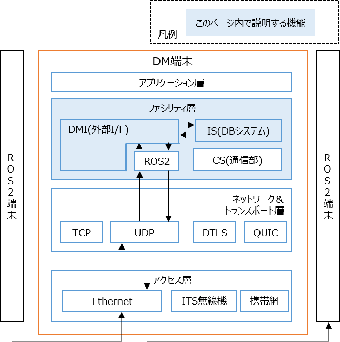

# 物標情報のROSトピックを生成して、DM2.0 Platformを通してsubscribe/publishする
## 1. 概要
---

ROS2端末とDM端末（DM2.0をインストールした端末）との連携動作を確認できます。トピックのサンプルは、物標情報を用います。物標情報のフィールドの構成については、カスタムROSメッセージ[dm_object_info_msgs/msg/ObjectInfoArray.msg](../../dmi/ros2/dm_msgs/dm_object_info_msgs/msg/ObjectInfoArray.msg)を確認することで理解できます。各フィールドの仕様については、[CooL4 API仕様](https://www.road-to-the-l4.go.jp/activity/theme04/pdf/CooL4_DataIntegrationPF_API_Spec_v100.pdf)の物標情報の項目を参照して下さい。



ROS2端末は、[ros2 foxy](https://docs.ros.org/en/foxy/Installation/Ubuntu-Install-Debians.html)がインストールされている事が前提です。

---

## 2 DM2.0 Platformの動作確認環境

### ネイティブ環境（非Docker）
- Ubuntu 20.04, ros2 foxy

### Docker環境
- [dmiの動作確認環境](../../dmi/README.md#動作確認環境)を参照

## 3 導入手順

### 3.1 DM端末へdmiをインストール

- [dmiのインストール](../../dmi/README.md#dockerイメージの構築)を参照

### 3.2 ros2dmiの設定
- [リポジトリのルートディレクトリ/dm2/conf/dmiConf.yml](../../dm2/conf/dmiConf.yml)を編集します。
疎通確認するだけであれば、下記の通り、コメントアウトを外すだけで問題ありません。

```text
 ros2:
   subscriber:
     object_info:
       targetTable: object_info_0_8_1
       topicName: /object_info/local
       topicType: ObjectInfoArray
       logIntervalMilliSecond: 300000
   publisher:
     object_info:
       targetTable: object_info_0_8_1
       topicName: /object_info/dm
       topicType: ObjectInfoArray
       logIntervalMilliSecond: 300000
       query: master object_info_0_8_1 select * from object_info_0_8_1 [range 300 msec]
```

### 3.3 DM2.0 PlatformのDBシステムの起動

DM2.0 PlatformのDBシステムを起動します。

```bash
dm2is 
```

### 3.4 物標情報のROSトピック生成（ROS2端末 - 送信側）

カスタムROSメッセージ[dm_msgs](../../dmi/ros2/dm_msgs/)を送信側のROS2端末上のワークディレクトリ（例：`dm_msgs_ws`）にコピーして、ビルドします。

```bash
source /opt/ros/foxy/setup.bash
cd dm_msgs_ws
colcon build --symlink-install
```

物標情報のROSトピックを生成する[サンプルスクリプト](python)をワークディレクトリ（例：`dm_msgs_ws`）にコピーして、起動します。

```bash
source install/setup.bash 
cd python
pip install pyyaml
python3 yaml_publish_object_info.py
```

### 3.5 物標情報のROSトピック確認（DM端末側）

DM端末側で、物標情報のROS2トピックが出力されている事を確認します。ROS2 foxyがDocker環境内にある場合は、dm2isのコンテナ内での確認となります。

```bash
source /opt/ros2/foxy/setup.bash
source /opt/ws/install/setup.bash
ros2 topic echo /object_info/local
```

### 3.6 物標情報のROSトピック確認（ROS2端末 - 受信側）

- カスタムROSメッセージ[dm_msgs](../../dmi/ros2/dm_msgs/)を送信側のROS2端末上のワークディレクトリ（例：`dm_msgs_ws`）にコピーして、ビルドします。ビルド方法は[3.4](#34-物標情報のrosトピック生成ros2端末---送信側)参照。

- 受信側のROS2端末上で、物標情報のROS2トピックが出力されている事を確認します。

```bash
source /opt/ros2/foxy/setup.bash
source dm_msgs_ws/install/setup.bash
ros2 topic echo /object_info/dm
```

### 4 複数台のDMを利用した構成

- DM端末を2台以上用意することで、例えば、V2Xの実用的な構成（例：道路インフラ装置内のROSトピックを車両側へ連携させる構成）が可能です。
- 2台のDM端末間の通信動作例については、[こちら](../../example/README.md)