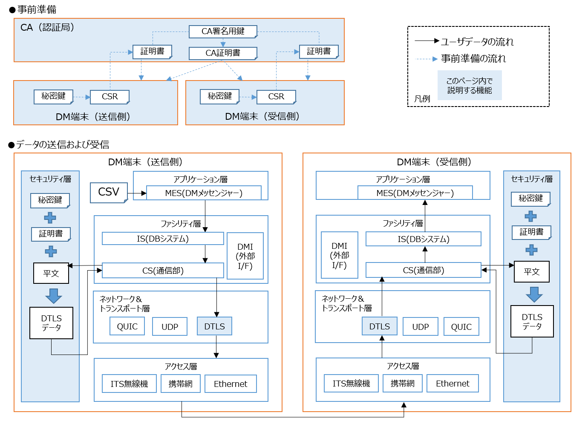

# DTLS通信を使う

---

DTLS通信を行うための設定を説明します。PKIの仕組みとして、送信側・受信側以外に、CA（認証局）の役割を持った端末を用意して下さい。


---

## 事前準備（PKIの構築コマンド例）
---

### CA側

- ワークディレクトリ上で、CA秘密鍵およびCA証明書発行のための署名要求（CSR）を生成します。
```bash
openssl ecparam -genkey -name prime256v1 -out key_pair.pem
openssl ec -in key_pair.pem -outform PEM -out ca_private.key
openssl req -new -sha256 -key ca_private.key -subj "/CN=root" > ca_csr.csr
```
- CSRを自身の秘密鍵で署名し、CA証明書を生成します。`-days`の値は運用に合わせて適宜変更して下さい。
- 生成したCA証明書は、セキュアな通信手段（例：httpsなど）を使って、送信側・受信側へと配布して下さい。
```bash
openssl x509 -req -in ca_csr.csr -signkey ca_private.key -out ca-cert.pem -days 365 -extfile /etc/ssl/openssl.cnf -extensions v3_ca
```
---
- もしルートCA → 中間CA → DM端末の3層構造にしたい場合は、中間CA内でCSRまで生成し、ルートCAで署名する事でチェーンを作成できます。

### 送信側

- ワークディレクトリ上で、送信側の秘密鍵およびCSRを生成します。
```bash
openssl ecparam -genkey -name prime256v1 -out client-key.pem
openssl req -new -sha256 -key client-key.pem -subj "/CN=client" > client.csr
```
- 生成したCSRは、セキュアな通信手段（例：httpsなど）を使って、CAへ送信して下さい。

### 受信側

- ワークディレクトリ上で、受信側の秘密鍵およびCSRを生成します。
```bash
openssl ecparam -genkey -name prime256v1 -out server-key.pem
openssl req -new -sha256 -key server-key.pem -subj "/CN=server" > server.csr
```
- 生成したCSRは、セキュアな通信手段（例：httpsなど）を使って、CAへ送信して下さい。

### CA側

- 送信側・受信側のCSRをCAの秘密鍵で署名し、証明書を生成します。`-days`の値は運用に合わせて適宜変更して下さい。
```bash
openssl x509 -req -in client.csr -CA ca-cert.pem -CAkey ca_private.key -CAcreateserial -out client-cert.pem -days 365
openssl x509 -req -in server.csr -CA ca-cert.pem -CAkey ca_private.key -CAcreateserial -out server-cert.pem -days 365
```
- 生成した2つの証明書は、それぞれセキュアな通信手段（例：httpsなど）を使って、送信側・受信側へと配布して下さい。
---

### 送信側

- ワークディレクトリ上で生成した秘密鍵と、CAから配布された証明書をリポジトリのルートディレクトリ/conf/cs_dtls/certsディレクトリに移動します。
```bash
mkdir -p ~/dm20/dm2/conf/cs_dtls/certs
mv client-key.pem client-cert.pem ca-cert.pem ~/dm20/dm2/conf/cs_dtls/certs
```

### 受信側

- ワークディレクトリ上で生成した秘密鍵と、CAから配布された証明書をリポジトリのルートディレクトリ/conf/cs_dtls/certsディレクトリに移動します。
```bash
mkdir -p ~/dm20/dm2/conf/cs_dtls/certs
mv server-key.pem server-cert.pem ca-cert.pem ~/dm20/dm2/conf/cs_dtls/certs
```

## 動作確認
---

- DM端末のプロセスの動かし方は、[2端末上でUDP(暗号化なし)通信を使って、ストリームデータを送受信する](../command/02_dm2is_to_dm2cs/README.md)を参照して下さい。

### 送信側・受信側のconf/dm2.conf編集

- 送信側および受信側の[dm2.conf](../../dm2/conf/dm2.conf)のSOCKET_TYPE_1を`dtls`に変更します。

```text
SOCKET_TYPE_1 = dtls
```

- 変更後、`dm2cs_send`および`dm2cs_recv`を再起動し、送信側のDMメッセンジャーでユーザデータを送信すると、ユーザデータは暗号化された上で、受信側のDMメッセンジャーへと届くようになります。

### tsharkによるDTLSのハンドシェイク確認

- tsharkをインストールしていれば、DTLSによるハンドシェイクの流れを確認することができます。
```bash
sudo tshark -i any -f "udp port 55555"
```
```text
    1 DTLS Client Hello
    2 DTLS Hello Verify Request
    3 DTLS Client Hello
    4 DTLS Server Hello, Certificate, Server Key Exchange, Certificate Request, Server Hello Done
    5 DTLS Certificate, Client Key Exchange, Certificate Verify, Change Cipher Spec, Encrypted Handshake Message
    6 DTLS New Session Ticket, Change Cipher Spec, Encrypted Handshake Message
    7 DTLS Application Data
```

## トラブルシューティング
---

- もし鍵・証明書が所定の場所に置いていない場合は、エラーとなります。

```text
ERROR: no certificate found!
```

