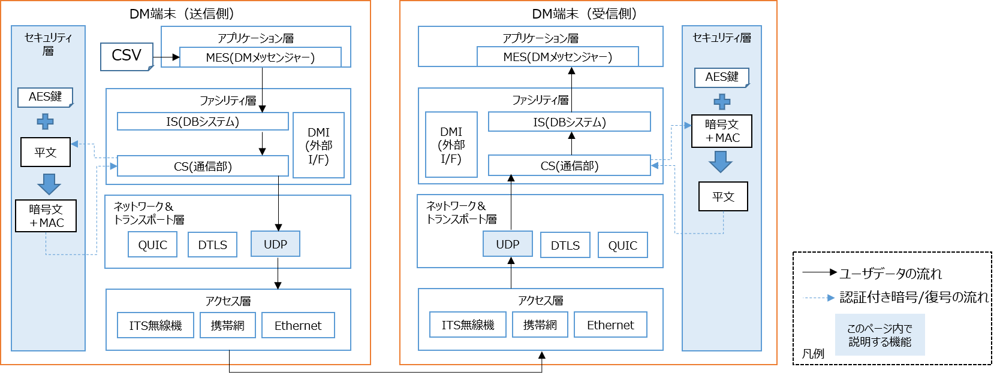

# UDP(暗号化あり)通信を使う
---

UDP(暗号化あり)の通信を行うための設定を説明します。暗号化のためにAES鍵を使用します。


---

## 送信側・受信側のconf/dm2.conf編集

- 送信側および受信側の[dm2.conf](../../dm2/conf/dm2.conf)のSOCKET_TYPE_1を`udp_etm`に変更して下さい。
- UDP_ETM_AES_KEY_1の項目を追加し、AES-128 用の16文字の鍵を設定してください。

```text
SOCKET_TYPE_1 = udp_etm
UDP_ETM_AES_KEY_1 = <任意の英数字16文字>
```

### 注意事項

- 送信側・受信側で同じ鍵を設定してください。
- セキュリティ向上のため、AES鍵は定期的に変更（ローテーション）することを推奨します。

## 動作確認
---

- DM端末のプロセスの動かし方は、[2端末上でUDP(暗号化なし)通信を使って、ストリームデータを送受信する](../command/02_dm2is_to_dm2cs/README.md)を参照して下さい。

