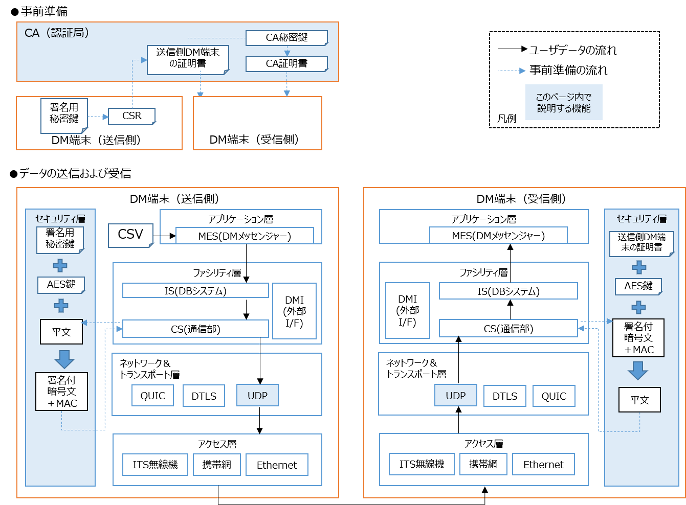

# UDP(暗号化あり・署名あり)通信を使う
---

UDP(暗号化あり・署名あり)の通信を行うための設定を説明します。PKIの仕組みとして、送信側・受信側以外に、CA（認証局）の役割を持った端末を用意して下さい。


---

## 事前準備（PKIの構築コマンド例）
---

### CA側

- ワークディレクトリ上で、CA秘密鍵およびCA証明書を生成します。`-days`の値は運用に合わせて適宜変更して下さい。
- 生成したCA証明書は、セキュアな通信手段（例：httpsなど）を使って、受信側へ配布して下さい。
```bash
openssl ecparam -genkey -name prime256v1 -out ca.key.pem
openssl req -x509 -new -key ca.key.pem -sha256 -days 365 -out ca.cert.pem
```

### 送信側

- ワークディレクトリ上で、送信側の秘密鍵およびCSRを生成します。
- 出力する秘密鍵のファイル名は、[dm2.conf](../../dm2/conf/dm2.conf)の`MY_STATION_ID`の値`.private.pem`にして下さい。
```bash
openssl ecparam -genkey -name prime256v1 -out <MY_STATION_IDの値>.private.pem
openssl req -new -key <MY_STATION_IDの値>.private.pem -out <MY_STATION_IDの値>.csr.pem
```
- 生成したCSRは、セキュアな通信手段（例：httpsなど）を使って、CAへ送信して下さい。

### CA側

- 送信側のCSRをCAの秘密鍵で署名し、証明書を生成します。`-days`の値は運用に合わせて適宜変更して下さい。
```bash
openssl x509 -req -in <送信側DM端末のMY_STATION_IDの値>.csr.pem -CA ca.cert.pem -CAkey ca.key.pem -CAcreateserial -out <送信側DM端末のMY_STATION_IDの値>.cert.pem -days 365 -sha256
```
- 生成した証明書は、それぞれセキュアな通信手段（例：httpsなど）を使って、受信側へ配布して下さい。
---

### 送信側

- ワークディレクトリ上で生成した秘密鍵をリポジトリのルートディレクトリ/conf/cs_udp_pkiディレクトリに移動します。
```bash
mkdir ~/dm20/dm2/conf/cs_udp_pki
mv <MY_STATION_IDの値>.private.pem ~/dm20/dm2/conf/cs_udp_pki
```

### 受信側

- CAから配布されたCA証明書および、送信側DM端末の証明書をリポジトリのルートディレクトリ/conf/cs_udp_pkiディレクトリに移動します。
```bash
mkdir ~/dm20/dm2/conf/cs_udp_pki
mv ca.cert.pem <送信側DM端末のMY_STATION_IDの値>.cert.pem ~/dm20/dm2/conf/cs_udp_pki
```

## 動作確認
---

- DM端末のプロセスの動かし方は、[2端末上でUDP(暗号化なし)通信を使って、ストリームデータを送受信する](../command/02_dm2is_to_dm2cs/README.md)を参照して下さい。

### 送信側・受信側のconf/dm2.conf編集

- 送信側および受信側の[dm2.conf](../../dm2/conf/dm2.conf)のSOCKET_TYPE_1を`udp_pki`に変更します。

```text
SOCKET_TYPE_1 = udp_pki
```

- 変更後、`dm2cs_send`および`dm2cs_recv`を再起動し、送信側のDMメッセンジャーでユーザデータを送信すると、ユーザデータは署名付き且つ、暗号化された上で、受信側のDMメッセンジャーへと届くようになります。

## トラブルシューティング
---

- もし送信側DM端末で鍵が所定の場所に置いていない場合は、エラーとなります。

```text
ERROR: no private key found
```

- もし受信側DM端末でCA証明書が所定の場所に置いていない場合は、エラーとなります。
```text
ERROR: no ca-certificate found
```
