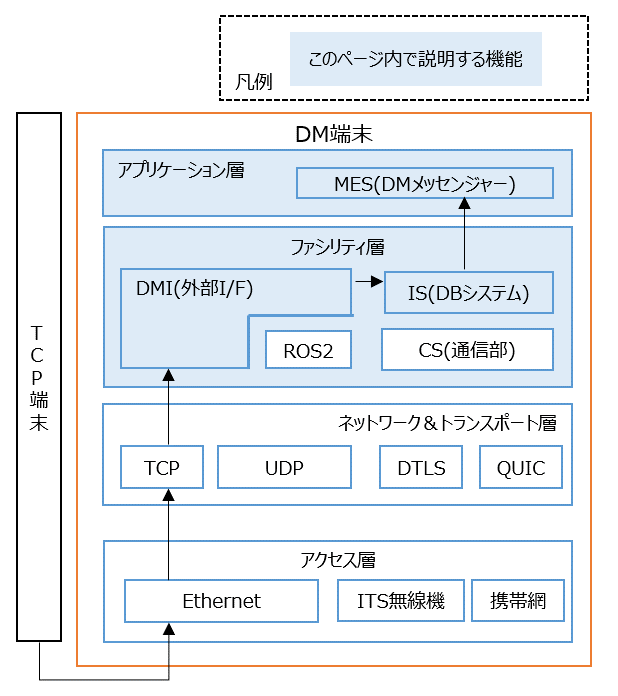

# TCPのサンプルデータ生成ツールを使って、DM2.0 Platformとの連携を確認する
---
## 1. 概要
---

TCP端末（TCPデータを送信する端末）とDM端末（DM2.0をインストールした端末）との連携動作を確認できます。

対応するバイナリ型のTCPデータについては、[TCP_DMIの概要](../../dmi/udptcp/tcp_dmi/README.md#概要)を参照して下さい。



---

## 2 DM2.0 Platformの動作確認環境

Ubuntu 20.04, Ubuntu 22.04, Ubuntu 24.04

### Docker環境
- [dmiの動作確認環境](../../dmi/README.md#動作確認環境)を参照

## 3 導入手順

### 3.1 DM端末へdmiをインストール

- [dmiのインストール](../../dmi/README.md#dockerイメージの構築)を参照


### 3.2 DBシステム・DMIの起動（DM端末側）

DM2.0 PlatformのDBシステムを起動します。引数にはリポジトリのルートディレクトリ/dm2/confディレクトリを指定して下さい。

```bash
dm2is -d ~/dm20/dm2/conf
```
別ターミナルでTCP_DMIのTCP-Receiver（DM2.0-uploader）を起動します。

`dm_user`と`dm_pass`は、[dm2インストール時の初期設定](../../dm2/README.md#rdbの設定)の値です。

```bash
tcp_dmi_receiver_signal_info --dm_user dm2sampleuser --dm_pass dm2samplepassword --receive_port 54347
```

### 3.3 TCPデータ受信待ち（DM端末側）

DM端末側で、DMメッセンジャーを受信モード（-r）で起動します。

`-S`で指定しているのは信号情報のデータストリーム名になります。

```bash
dm2mes -r -S signal_info
```

### 3.4 TCPデータ生成・送信（TCP端末 - 送信側）

事前に下記ツールをインストールします。

```bash
pip install scapy
```

TCPデータを生成・送信する[サンプルスクリプト](python)をTCP端末（送信側）にコピーして、起動します。

```bash
python3 tcp_sender.py  --port 54347 --format ../../../docs/yamls/signal_info.yaml --mode sample --interval 1.0 --ip <DM端末のIPアドレス>
```

`--mode`に`csv`を指定し、CSVファイルを入力値とする事も可能です。

```bash
python3 tcp_sender.py  --port 54347 --format ../../../docs/yamls/signal_info.yaml --mode csv --value_csv ../../udp/python/signal_info_value.csv --ip <DM端末のIPアドレス>
```

### 3.5 TCPデータ受信確認（DM端末側）

受信モードのターミナル上にデータが表示されます。

- `--mode`に`sanple`を指定した場合
```text
0,[0,0,0,0,0,0,0,0],0,0,0,0,0,0,0,0,0,0,0,0,0,0,0,0,0,0,0,0,0,0,0,0,0,0,0,0,0,0,0,0,0,0,0,0,0,0,0,0,0,0,0,0,0,0,0,0,0,0,0,0,0
1,[1,1,1,1,1,1,1,1],1,1,1,1,1,1,1,1,1,1,1,1,1,1,1,1,1,1,1,1,1,1,1,1,1,1,1,1,1,1,1,1,1,1,1,1,1,1,1,1,1,1,1,1,1,1,1,1,1,1,1,1,1
```

- `--mode`に`csv`を指定した場合
```test
1001,[1,2,3,4,5,6,7,8],1717000000000,3,0,10,0,1,0,50,60,1,0,50,60,1,0,50,60,1,0,50,60,1,0,50,60,1,0,50,60,1,0,50,60,1,0,50,60,1,0,50,60,1,0,50,60,1,0,50,60,1,0,50,60
```

### 4 複数台のDMを利用した構成

- DM端末を2台以上用意することで、例えば、V2Xの実用的な構成（例：道路インフラ装置内のTCPデータを車両側へ連携させる構成）が可能です。
- 2台のDM端末間の通信動作例については、[こちら](../../example/README.md)