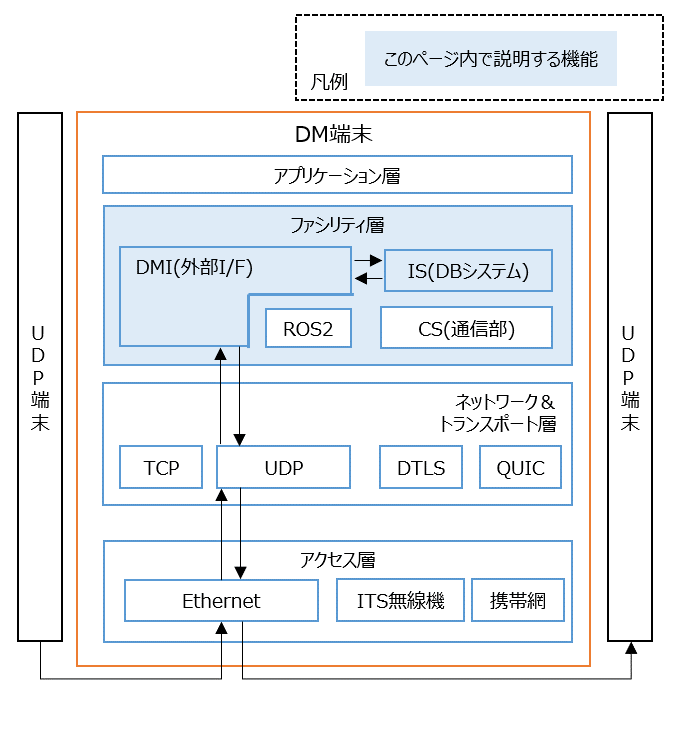

# UDPのサンプルデータ生成ツールを使って、DM2.0 Platformとの連携を確認する
---
## 1. 概要
---

UDP端末（UDPデータを送信/受信する端末）とDM端末（DM2.0をインストールした端末）との連携動作を確認できます。トピックのサンプルは、物標情報を用います。物標情報のフィールドの構成については、[object_info.yaml](../../docs/yamls/object_info.yaml)を確認することで理解できます。各フィールドの仕様については、[CooL4 API仕様](https://www.road-to-the-l4.go.jp/activity/theme04/pdf/CooL4_DataIntegrationPF_API_Spec_v100.pdf)の物標情報の項目を参照して下さい。



---

## 2 DM2.0 Platformの動作確認環境

### ネイティブ環境（非Docker）
- Ubuntu 20.04

### Docker環境
- [dmiの動作確認環境](../../dmi/README.md#動作確認環境)を参照

## 3 導入手順

### 3.1 DM端末へdmiをインストール

- [dmiのインストール](../../dmi/README.md#dockerイメージの構築)を参照


### 3.2 DBシステム・DMIの起動

下記２パターンで起動方法が分かれます。

- [a. DBシステム・DMIをDockerイメージで構築した場合](#32a-dockerイメージで構築した場合の-dbシステムdmiの起動方法)
- [b. 手動インストールした場合（非Dockerの場合）](#32b-手動インストールでdbシステムとudp_dmiをインストールした場合の-dbシステムdmiの起動方法)

### 3.2.a Dockerイメージで構築した場合の DBシステム・DMIの起動方法
- [リポジトリのルートディレクトリ/dm2/conf/dmiConf.yml](../../dm2/conf/dmiConf.yml)を編集します。
疎通確認するだけであれば、下記の通り、コメントアウトを外すだけで問題ありません。

```text
 udp:
   receiver:
     object_info:
       targetTable: object_info_0_8_1
       receptionPort: 54345
   sender:
     object_info_0_8_1:
       targetIpAddr: 127.0.0.1
       targetPort: 44345
       frameRateMaxMilsec: 33
       dataNumPerFrame: 6
       query: master sysTimer100msec select * from object_info_0_8_1 [range 300 msec]
```

DM2.0 PlatformのDBシステムを起動します。Dockerイメージで構築した場合のROS2DMIは、DBシステム内から動的ライブラリとして呼び出されるため、起動コマンドはありません。

```bash
dm2is 
```
### 3.2.b 手動インストールでDBシステムとUDP_DMIをインストールした場合の DBシステム・DMIの起動方法

DM2.0 PlatformのDBシステムを起動します。引数にはリポジトリのルートディレクトリ/dm2/confディレクトリを指定して下さい。

```bash
dm2is -d ~/dm20/dm2/conf
```

別ターミナルでUDP_DMIのUDP-Sender（DM2.0-downloader）を起動します。

`dm_user`と`dm_pass`は、[dm2インストール時の初期設定](../../dm2/README.md#rdbの設定)の値です。

```bash
udp_dmi_sender_object_info --dm_user dm2sampleuser --dm_pass dm2samplepassword --target_port 44345
```

別ターミナルでUDP_DMIのUDP-Receiver（DM2.0-uploader）を起動します。

```bash
udp_dmi_receiver_object_info --dm_user dm2sampleuser --dm_pass dm2samplepassword --receive_port 54345
```

### 3.3 UDPデータ生成・送信（UDP端末 - 送信側）

UDPデータを生成・送信する[サンプルスクリプト](python)をUDP端末（送信側）にコピーして、起動します。

```bash
pip install scapy
python3 udp_sender.py  --port 54345 --ip <DM端末のIPアドレス> --format udp_object_info_format.csv --mode csv --value_csv udp_object_info_value.csv --output udp
```

### 3.4 UDPデータ受信確認（DM端末側）

DM端末側で、物標情報が受信できている事を確認します。

```bash
dm2mes -r -S object_info_0_8_1
```

### 3.5 UDPデータの受信確認（UDP端末 - 受信側）

UDPデータを受信する[サンプルスクリプト](python)をUDP端末（受信側）にコピーして、起動します。

```bash
pip install scapy
python3 udp_receiver.py --port 44345 --format udp_object_info_format.csv --output_csv received.csv --max_count 1
```

### 4 複数台のDMを利用した構成

- DM端末を2台以上用意することで、例えば、V2Xの実用的な構成（例：道路インフラ装置内のUDPデータを車両側へ連携させる構成）が可能です。
- 2台のDM端末間の通信動作例については、[こちら](../../example/README.md)